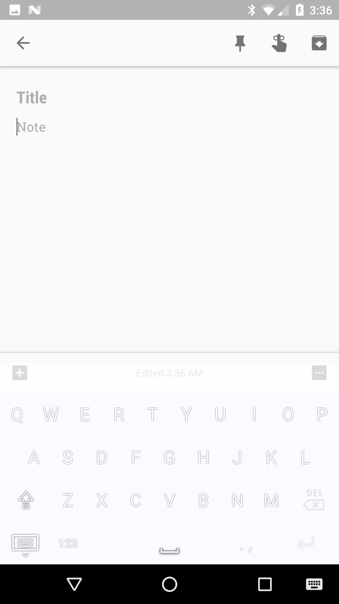
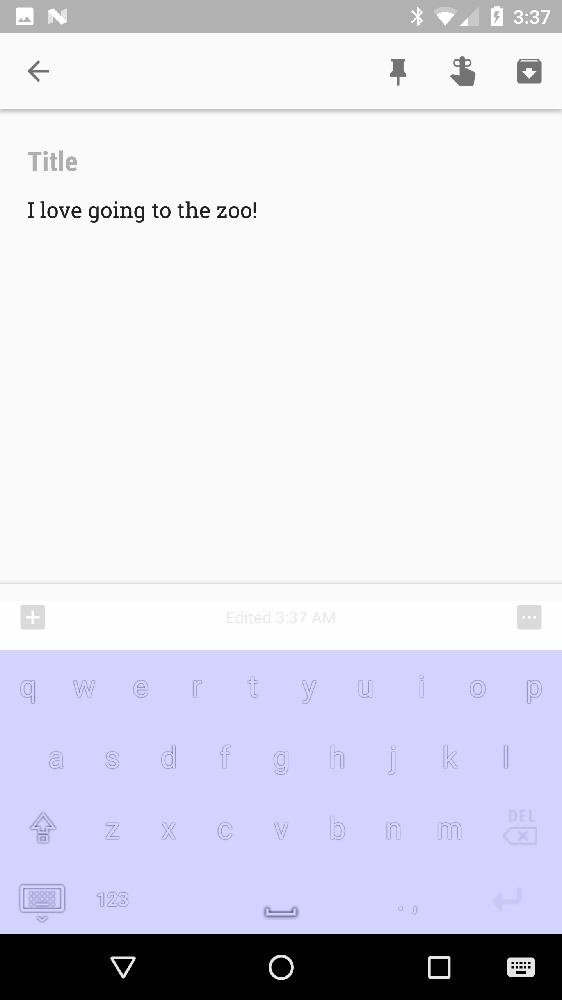
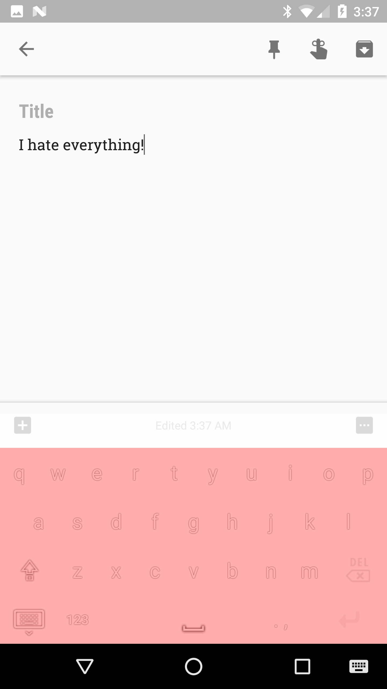

# Anti Hate Keyboard

Fork of https://github.com/blackcj/AndroidCustomKeyboard

Android custom keyboard that uses the IBM Bluemix API to determine the levels of anger or joy in the content of the what the user is typing.  Uses this information to make the keyboard either blue or red for the purpose of alerting the user if what they are typing could potentially be harmful in an attempt to limit online harrasment.

Written in Java using Android Studio.

Made for the 2017 Los Altos Hacks II hackathon with @CheetahGod and @acsamuraix.  Won Third Place and Hacker Harrassment award.

